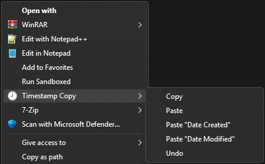
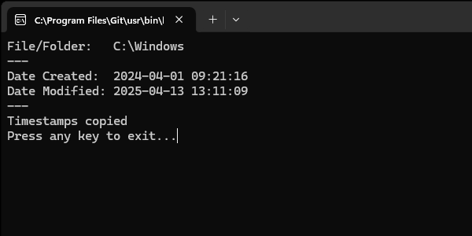
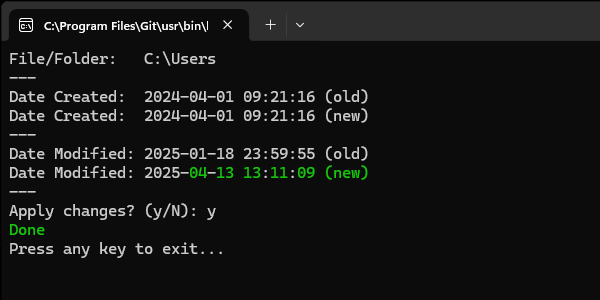


# Timestamp Copy

Timestamps Copy is a lightweight PowerShell script that integrates directly into the Windows File Explorer context menu, enabling you to **copy** and **paste** file and folder timestamps with ease.

This solution is especially useful when you need to preserve or replicate Date Created and Date Modified values across files or folders – ideal for organizing backups, restoring files, or syncing metadata.

### Latest Release

[](https://github.com/jurakovic/timestamp-copy/releases/latest)

### Features

#### Explorer Context Menu Integration

Adds convenient right-click options for both files and folders:



#### Copy Mode

Stores the selected file or folder's Date Created and Date Modified timestamps for reuse.

#### Paste Mode

Applies the previously copied timestamps to the currently selected file or folder.

#### Selective Timestamp Paste

Use the specific `Paste 'Date Created'` or `Paste 'Date Modified'` options to update only the desired timestamp.

### Usage

Right-click on a file or folder and choose `Copy` under the context menu.  
This saves the timestamps to a temporary location ("clipboard").

Right-click on another file or folder and choose:

`Paste` – to apply both timestamps  
`Paste 'Date Created'` – to apply only the Date Created  
`Paste 'Date Modified'` – to apply only the Date Modified  

Each entry runs the [`TimestampCopy.ps1`](TimestampCopy.ps1) script with the appropriate parameters (example screenshots below).

### Requirements

- Windows 10/11 (tested on Windows 11 24H2)  
- PowerShell 5.1 or later  
- Administrator privileges (required for installation)

### Installation

1. Clone the repository.
	```powershell
	git clone https://github.com/jurakovic/timestamp-copy.git
	```
2. Open an elevated Powershell terminal ('Run as Administrator').
3. Navigate to the directory where you cloned the repository.
	```powershell
	cd timestamp-copy
	```
4. Add the context menu entries. This can be done in two ways.  
	Run the `TimestampCopy.ps1` script
	```powershell
	.\TimestampCopy.ps1
	```

	and then choose the option `i`
	```text
	Timestamp Copy (2.0.0)

	[i] Install
	[u] Uninstall

	[q] Quit

	Choose option:
	```

	or run the script with the `-i` option to install it directly:
	```powershell
	.\TimestampCopy.ps1 -i
	```

### Screenshots

Copy  


Paste  


### Limitation

This script is designed to work with **only one selected file or folder at a time**. While it does appear in the context menu when multiple items are selected, it will be executed **independently for each item**. This can lead to unexpected behavior. For accurate and predictable results, always use it with a single selection.

### Disclaimer

This script is provided **as-is**, without any warranties or guarantees of fitness for a particular purpose. While it should work reliably in most cases, use it at your own risk.  

---

> #### Previous Releases
>
> - <small>[v1.0.0](https://github.com/jurakovic/timestamp-copy/releases/tag/v.1.0.0): Initial [`tscp.sh`](https://github.com/jurakovic/timestamp-copy/blob/v.1.0.0/tscp.sh) written in Bash. It was created solely for educational and experimental use.</small>  
> - <small>[v2.0.0-preview.1](https://github.com/jurakovic/timestamp-copy/releases/tag/v2.0.0-preview.1): Direct port of the original Bash script into PowerShell, with only the minimal necessary changes made to ensure proper execution in a PowerShell environment.</small>  
> - <small>[v2.0.0](https://github.com/jurakovic/timestamp-copy/releases/tag/v2.0.0): Complete rewrite of the original Bash script in native PowerShell syntax.</small>  

---

### References

<https://stackoverflow.com/questions/20449316/how-add-context-menu-item-to-windows-explorer-for-folders>  
<https://www.tomshardware.com/software/windows/how-to-add-custom-shortcuts-to-the-windows-11-or-10-context-menu>  
<https://blog.sverrirs.com/2014/05/creating-cascading-menu-items-in.html>  
<https://learn.microsoft.com/en-us/windows/win32/shell/context-menu-handlers>  
<https://mrlixm.github.io/blog/windows-explorer-context-menu/>  
