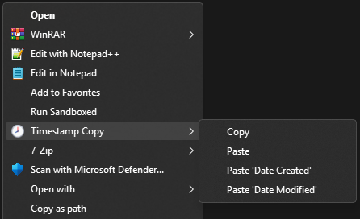

# Timestamp Changer

Timestamps Changer is a lightweight Bash and PowerShell-based script that integrates directly into the Windows File Explorer context menu, enabling you to **copy** and **paste** file and folder timestamps with ease.

This solution is especially useful when you need to preserve or replicate Date Created and Date Modified values across files or folders – ideal for organizing backups, restoring files, or syncing metadata.

### Features

#### Explorer Context Menu Integration

Adds convenient right-click options for both files and folders:

<!--
`🕗 Timestamp Changer`  
&nbsp; &nbsp; `Copy`  
&nbsp; &nbsp; `Paste`  
&nbsp; &nbsp; `Paste 'Date Created'`  
&nbsp; &nbsp; `Paste 'Date Modified'`  
-->



#### Copy Mode

Stores the selected file or folder's Date Created and Date Modified timestamps for reuse.

#### Paste Mode

Applies the previously copied timestamps to the currently selected file or folder.

#### Selective Timestamp Paste

Use the specific `Paste 'Date Created'` or `Paste 'Date Modified'` options to update only the desired timestamp.

### Usage

Right-click on a file or folder and choose `Copy` under the context menu.  
This saves the timestamps to a temporary location ("clipboard").

Right-click on another file or folder and choose:

`Paste` – to apply both timestamps  
`Paste 'Date Created'` – to apply only the creation date  
`Paste 'Date Modified'` – to apply only the modified date  

Each entry starts Bash terminal and runs the `tsch.sh` script with the appropriate parameters (example screenshots below).

### Requirements

Windows 10/11 (Tested only on Windows 11 24H2)  
PowerShell 5.1 or later  
Bash  

> **Bash on Windows** can be installed in several ways, including:
> - [Git for Windows](https://gitforwindows.org) (comes with the MSYS2 runtime – [Git for Windows flavor](https://github.com/git-for-windows/build-extra/blob/main/ReleaseNotes.md))
> - [MSYS2](https://www.msys2.org)
> - [Cygwin](https://cygwin.com)
> - [Windows Subsystem for Linux (WSL)](https://learn.microsoft.com/en-us/windows/wsl/install)
>  
> The recommended way is to use **Git for Windows** (MSYS2) as it provides a lightweight and user-friendly environment for running Bash scripts on Windows.  
> This repository is designed to work with the  Git for Windows (MSYS2). It works with the official MSYS2 runtime too, but it doesnt't work with Cygwin or WSL. It could work with some minor modifications, but I don't plan to do it.  

### Installation

1. Clone or download the repository to your local machine.
	```bash
	git clone https://github.com/jurakovic/timestamp-changer.git
	```
2. Open a Bash terminal with admin privileges.
3. Navigate to the directory where you cloned or downloaded the repository.
	```bash
	cd timestamp-changer
	```
4. Add the context menu entries. It can be done in two ways.  
	Run the `tsch.sh` script
	```bash
	./tsch.sh
	```

	and then choose the option `i`
	```text
	Timestamp Changer (0.1.0)

	[i] Install
	[u] Uninstall

	[q] Quit

	Choose option:
	```

	or run the script with the `-i` option to install it directly:
	```bash
	./tsch.sh -i
	```

### Screenshots

Copy  


Paste (confirmation)  


Paste (done)  


### Limitation

This script is designed to work with **only one selected file or folder at a time**. While it does appear in the context menu when multiple items are selected, it will be executed **independently for each item**. This can lead to unexpected behavior. For accurate and predictable results, always use it with a single selection.

### References

<https://stackoverflow.com/questions/20449316/how-add-context-menu-item-to-windows-explorer-for-folders>  
<https://www.tomshardware.com/software/windows/how-to-add-custom-shortcuts-to-the-windows-11-or-10-context-menu>  
<https://blog.sverrirs.com/2014/05/creating-cascading-menu-items-in.html>  
<https://learn.microsoft.com/en-us/windows/win32/shell/context-menu-handlers>  
<https://mrlixm.github.io/blog/windows-explorer-context-menu/>  
