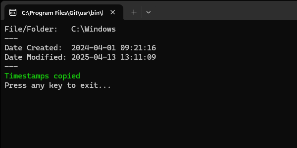

# Timestamp Copy

[`TimestampsCopy.ps1`](./TimestampCopy.ps1) is PowerShell script that integrates directly into the Windows File Explorer context menu, enabling you to **copy** and **paste** file and folder timestamps with ease.

This solution is especially useful when you need to preserve or replicate Date Created and Date Modified values across files or folders – ideal for organizing backups, restoring files, or syncing metadata.

  
<sup>(Context Menu)</sup>

### Download

[](https://github.com/jurakovic/timestamp-copy/releases/latest)

### Usage <sub><sup>(Short)</sup></sub>

#### Context Menu

Right-click on a file or folder and choose `Copy` under the context menu. This stores the selected file or folder's Date Created and Date Modified timestamps to a temporary location for reuse.

Right-click on another file or folder and choose:

`Paste` – to apply previously copied timestamps  
`Paste "Date Created"` – to apply only the Date Created  
`Paste "Date Modified"` – to apply only the Date Modified  

Each `Paste` operation, before overwriting timestamps with "new" ones, stores the selected file or folder's path and current ("old") timestamps to a temporary location.  
If you copy timestamps from a wrong file or folder and paste it to some file or folder, or you paste it to wrong file or folder, you can undo the operation by right-clicking on the file or folder and choosing `Undo` under the context menu.  

The `Undo` operation is avaliable on all files and folders, but it will only restore the timestamps for the file or folder that was last used in the `Paste` (or `Undo`) operation. `Undo` then does the same as `Paste` operation. It stores the *undo-ed* file or folder's path and current timestamps to a temporary location. If you again choose `Undo`, it will restore the timestamps back to the "new" values.  
If you choose `Undo` repeatedly, it will rotate the timestamps between the "old" and "new" values.  

#### CLI

The script is made to be run from the context menu, but it can also be run directly from the command line.

```powershell
# Copy timestamps
.\TimestampCopy.ps1 -c "C:\Foo.txt"

# Paste timestamps
.\TimestampCopy.ps1 -p "D:\Bar.txt"

# Paste Date Created
.\TimestampCopy.ps1 -pc "D:\Bar.txt"

# Paste Date Modified
.\TimestampCopy.ps1 -pm "D:\Bar.txt"

# Undo
.\TimestampCopy.ps1 -z
```

### Requirements

- Windows 10/11
- PowerShell 5.1 or later  
- Administrator privileges (required for installation)

### Installation

1. Clone the repository.
	```powershell
	git clone https://github.com/jurakovic/timestamp-copy.git
	```
2. Open an elevated Powershell terminal ('Run as Administrator').
3. Navigate to the directory where you cloned the repository.
	```powershell
	cd timestamp-copy
	```
4. Add the context menu entries. This can be done in two ways.  
	Run the `TimestampCopy.ps1` script
	```powershell
	.\TimestampCopy.ps1
	```

	and then choose the option `i`
	```text
	Timestamp Copy (2.1.0-preview.1)

	[i] Install
	[b] Install (Background Mode)
	[u] Uninstall

	[q] Quit

	Choose option:
	```

	or run the script with the `-i` option to install it directly:
	```powershell
	.\TimestampCopy.ps1 -i
	```

### Usage (Detailed)

todo: all operations, variants, modes, validations, examples, etc.

Copy  


Paste  


### Limitation

This script is designed to work with **only one selected file or folder at a time**. While it does appear in the context menu when multiple items are selected, it will be executed **independently for each item**. This can lead to unexpected behavior. For accurate and predictable results, always use it with a single selection.

### Disclaimer

This script is provided **as-is**, without any warranties or guarantees of fitness for a particular purpose. While it should work reliably in most cases, use it at your own risk.  

---

> #### Previous Releases
>
> - <small>[v1.0.0](https://github.com/jurakovic/timestamp-copy/releases/tag/v.1.0.0): Initial [`tscp.sh`](https://github.com/jurakovic/timestamp-copy/blob/v.1.0.0/tscp.sh) written in Bash. It was created solely for educational and experimental use.</small>  
> - <small>[v2.0.0-preview.1](https://github.com/jurakovic/timestamp-copy/releases/tag/v2.0.0-preview.1): Direct port of the original Bash script into PowerShell, with only the minimal necessary changes made to ensure proper execution in a PowerShell environment.</small>  
> - <small>[v2.0.0](https://github.com/jurakovic/timestamp-copy/releases/tag/v2.0.0): Complete rewrite of the original Bash script in native PowerShell syntax.</small>  

---

### References

<https://stackoverflow.com/questions/20449316/how-add-context-menu-item-to-windows-explorer-for-folders>  
<https://www.tomshardware.com/software/windows/how-to-add-custom-shortcuts-to-the-windows-11-or-10-context-menu>  
<https://blog.sverrirs.com/2014/05/creating-cascading-menu-items-in.html>  
<https://learn.microsoft.com/en-us/windows/win32/shell/context-menu-handlers>  
<https://mrlixm.github.io/blog/windows-explorer-context-menu/>  
